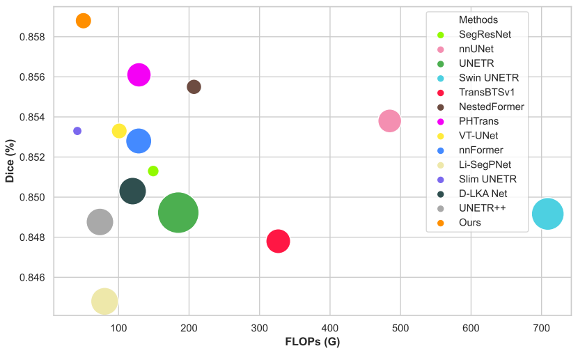

# Effective **G**lobal Context Integration for Lightweight 3D Medical Image Segmentation

Code for the following paper

Q. Qiao, M. Qu, W. Wang, B. Jiang, and Q. Guo, Effective global context integration for lightweight 3D medical image segmentation, *IEEE Transactions on Circuits and Systems for Video Technology*, 2024.

<hr />

**GCI-Net official repository**

## 📢 News

- **[2024.9.7]** Release the network_architecture of  BraTS2021 and Lung code.
- **[2024.4.29]** :smiley: You can use to download our trained models for direct validation, all the code coming soon.

<hr />

> **Abstract:** 
>
> ​	Subsequent disclosure
<hr />

## 🎨 Dice & FLOPs

--------




## Architecture overview of GCI-Net

<hr />

Subsequent disclosure

## ⚒️ Installation

The code is tested with PyTorch 1.11.0 and CUDA 11.3. 

Please clone this repository

```
git clone https://github.com/qintianjian-lab/GCI-Net.git
```

After cloning the repository, you can please follow the following two methods to install it.

**Method 1:**

1. Create and activate conda environment
```shell
conda create --name GCI_UNet python=3.8
conda activate GCI_UNet
```
2. Install PyTorch and torchvision
```shell
pip install torch==1.11.0+cu113 torchvision==0.12.0+cu113 --extra-index-url https://download.pytorch.org/whl/cu113
```
3. Install other dependencies
```shell
pip install -r requirements.txt
pip install -e .
```
**Method 2:**

```
cd GCI-UNet
conda env create -f environment.yml
source activate GCI_UNet
pip install -e .
```

<hr />

## 🏃‍♂️ Dataset

#### 1. Download Dataset

Datasets can be acquired via following links:

**Dataset I**   **MSD Task-01 Brain Tumor** [[website](http://medicaldecathlon.com/), Google Drive, [Baidu Netdisk](https://pan.baidu.com/s/1VMc87QXoWDTJc5hZP3mAdg?pwd=as72)]

**Dataset II**  **ACDC** [[website](https://www.creatis.insa-lyon.fr/Challenge/acdc/), [Google Drive](https://drive.google.com/file/d/1QDcEkpwH0xPs91Mny094OSA9DF8qKmM7/view?usp=drive_link), [Baidu Netdisk](https://pan.baidu.com/s/11A6pYnl_kibV_d8A8TSw4w?pwd=w8au)]

**Dataset III**  **BraTS2021**

**Dataset IV**  **MSD Task-06 Lung** 

We use [nnFormer]([282857341/nnFormer (github.com)](https://github.com/282857341/nnFormer)) and the [UNETR++]([Amshaker/unetr_plus_plus: UNETR++: Delving into Efficient and Accurate 3D Medical Image Segmentation (github.com)](https://github.com/Amshaker/unetr_plus_plus)) repository to split the data.

After you have downloaded the datasets, you can follow the settings in [nnUNet](https://github.com/MIC-DKFZ/nnUNet/blob/master/documentation/dataset_conversion.md) for path configurations and preprocessing procedures. We conducted extensive experiments on two benchmarks:  BraTS and ACDC.  Finally, your folders should be organized as follows: 

```
./DATASET/
  ├── gci_unet_raw/
      ├── gci_unet_raw_data/
           ├── Task01_ACDC/
              ├── imagesTr/
              ├── imagesTs/
              ├── labelsTr/
              ├── labelsTs/
              ├── dataset.json
           ├── Task03_tumor/
              ├── imagesTr/
              ├── imagesTs/
              ├── labelsTr/
              ├── labelsTs/
              ├── dataset.json
           ├── Task001_ACDC
           ├── Task003_ACDC
      ├── gci_unet_cropped_data/
           ├── Task001_ACDC
           ├── Task003_tumor
  ├── gci_unet_trained_models/
  ├── gci_unet_preprocessed/

```


Alternatively, you can download the preprocessed dataset for **BraTS**[GoogleDrive, [Baidu Netdisk](https://pan.baidu.com/s/1NqAYAlx9q7aZX4CwwQdgww?pwd=ngvs)], **ACDC**[[GoogleDrive](https://drive.google.com/file/d/1g1dxtxz27B5cVlrGhTCbHrlwIBQD7X36/view?usp=drive_link), [Baidu Netdisk](https://pan.baidu.com/s/1LHK7mlGIsDw8Dv-Zc8d3wA?pwd=wu0d)] and extract it under the project directory.

#### **2. Setting  environment variable**

We need to set the environment variables, in order for the program to be able to properly process the data, as well as save the results, take my experimental environment for example:

```
export gci_unet_raw_data_base="/srv/qiaoqiang/DATASET/gci_unet_raw"
export gci_unet_preprocessed="/srv/qiaoqiang/DATASET/gci_unet_preprocessed"
export gci_unet_RESULTS_FOLDER="/srv/qiaoqiang/DATASET/gci_unet_trained_models"
```

#### 3. Data preprocessing

After that, you can preprocess the above data using following commands:

```
gci_unet_convert_decathlon_task -i /srv/qiaoqiang/DATASET/gci_unet_raw/gci_unet_raw_data/Task01_ACDC
gci_unet_convert_decathlon_task -i /srv/qiaoqiang/DATASET/gci_unet_raw/gci_unet_raw_data/Task03_tumor
gci_unet_convert_decathlon_task -i /srv/qiaoqiang/DATASET/gci_unet_raw/gci_unet_raw_data/Task06_Lung

gci_unet_plan_and_preprocess -t 1
gci_unet_plan_and_preprocess -t 3
gci_unet_plan_and_preprocess -t 6
```

## 💃Training & Testing

The following scripts can be used for training and testing our GCI-Net model on the datasets:

we can change path in  `run_brats.sh` and `run_acdc.sh` 

then use chmod only in first time   `chmod +x run_acdc.sh`  and`chmod +x run_brats.sh`

**BraTS**

```
./run_brats.sh
```

**ACDC**

```
./run_acdc.sh
```

If you want use your own data, please create a new trainer file in the path `gciunet/training/network_training` and make sure the class name in the trainer file is the same as the trainer file. Some hyperparameters could be adjust in the trainer file, but the batch size and crop size should be adjust in the file `gciunet/run/default_configuration.py`.

You can download our pretrained model weights.

1- Download BraTS weights[[GoogleDrive](https://drive.google.com/file/d/1LEcI5dULODOYkXMxT371_DsK35SL4Ogu/view?usp=drive_link), [Baidu Netdisk](https://pan.baidu.com/s/1OHzFpTwcWjDYAdkwiyn7_g?pwd=t6q8)] and paste ```model_final_checkpoint.model``` and ```model_final_checkpoint.model.pkl``` it in the following path:

```
DATASET/gci_unet_trained_models/gci_unet/3d_fullres/Task003_tumor/gci_unet_trainer_tumor__gci_unet_Plansv2.1/fold_1/
```

2- Download ACDC weights[[GoogleDrive](https://drive.google.com/file/d/19r_PLsc10lBL1BNdFZ8UrfgI_jZnLadP/view?usp=drive_link), [Baidu Netdisk](https://pan.baidu.com/s/1dElXoFT0PMJb3iRXh2DoOQ?pwd=6fhj)] and paste ```model_final_checkpoint.model``` in the following path:

```shell
DATASET/gci_unet_trained_models/gci_unet/3d_fullres/Task001_ACDC/gci_unet_trainer_acdc__gci_unet_Plansv2.1/fold_1/
```

<hr />

## Evaluation

To reproduce the results of GCI-Net: 

We run inference to compute the Dice and HD95

**BraTS**

```
cd GCI-UNet/gciunet/evaluation/gci_unet_tumor_checkpoint
python inference_tumor.py
```

**ACDC**

```
cd  GCI-UNet/gciunet/evaluation/gci_unet_acdc_checkpoint
python inference_acdc.py
```

<hr />

## Contact
Should you have any question, please create an issue on this repository or contact me at qiaoqiang@mail.sdu.edu.cn.

